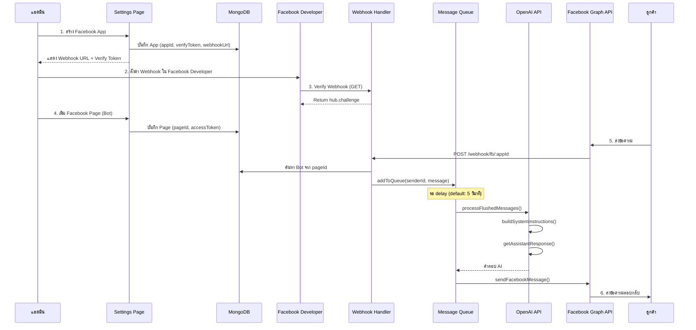

# รายงานการตรวจสอบระบบ AI ตอบแชท
## ChatCenterAI System Review Report

**วันที่ตรวจสอบ:** 10 ธันวาคม 2567  
**เวอร์ชัน:** ChatCenterAI-new

---

## สารบัญ

1. [ภาพรวมระบบ](#1-ภาพรวมระบบ)
2. [Flow การทำงานตั้งแต่เริ่มต้นจนจบ](#2-flow-การทำงานตั้งแต่เริ่มต้นจนจบ)
3. [ขั้นตอนที่ 1: การเพิ่ม Facebook App](#3-ขั้นตอนที่-1-การเพิ่ม-facebook-app)
4. [ขั้นตอนที่ 2: การเชื่อมต่อ Facebook Page](#4-ขั้นตอนที่-2-การเชื่อมต่อ-facebook-page-bot)
5. [ขั้นตอนที่ 3: การรับข้อความจากลูกค้า](#5-ขั้นตอนที่-3-การรับข้อความจากลูกค้า-webhook)
6. [ขั้นตอนที่ 4: การประมวลผล AI และตอบกลับ](#6-ขั้นตอนที่-4-การประมวลผล-ai-และตอบกลับ)
7. [ขั้นตอนที่ 5: การส่งข้อความไปยังลูกค้า](#7-ขั้นตอนที่-5-การส่งข้อความไปยังลูกค้า)
8. [รายงานปัญหาและข้อผิดพลาด](#8-รายงานปัญหาและข้อผิดพลาด)
9. [คำแนะนำในการปรับปรุง](#9-คำแนะนำในการปรับปรุง)
10. [สรุป](#10-สรุป)

---

## 1. ภาพรวมระบบ

### โครงสร้างระบบ

```
┌─────────────────────────────────────────────────────────────────────┐
│                         ChatCenterAI System                         │
├─────────────────────────────────────────────────────────────────────┤
│                                                                     │
│  ┌──────────────┐    ┌──────────────┐    ┌──────────────────────┐  │
│  │ Facebook App │    │  Line Bot    │    │  Admin Dashboard     │  │
│  └──────┬───────┘    └──────┬───────┘    └──────────┬───────────┘  │
│         │                   │                       │               │
│         ▼                   ▼                       ▼               │
│  ┌──────────────────────────────────────────────────────────────┐  │
│  │                    Webhook Handlers                          │  │
│  │  • /webhook/fb/:appId (Facebook App Shared)                  │  │
│  │  • /webhook/facebook/:botId (Legacy per-bot)                 │  │
│  │  • /webhook/line/:botId                                      │  │
│  └──────────────────────────┬───────────────────────────────────┘  │
│                             │                                       │
│                             ▼                                       │
│  ┌──────────────────────────────────────────────────────────────┐  │
│  │                     Message Queue                            │  │
│  │  • addToQueue() - รวมข้อความหลายข้อความ                        │  │
│  │  • flushQueue() - ประมวลผลเมื่อครบ delay                       │  │
│  └──────────────────────────┬───────────────────────────────────┘  │
│                             │                                       │
│                             ▼                                       │
│  ┌──────────────────────────────────────────────────────────────┐  │
│  │                      AI Processing                           │  │
│  │  • getAssistantResponseTextOnly()                            │  │
│  │  • getAssistantResponseMultimodal()                          │  │
│  │  • OpenAI API (GPT-5, GPT-5-mini, etc.)                      │  │
│  └──────────────────────────┬───────────────────────────────────┘  │
│                             │                                       │
│                             ▼                                       │
│  ┌──────────────────────────────────────────────────────────────┐  │
│  │                    Response Sender                            │  │
│  │  • sendFacebookMessage() - ส่งข้อความ Facebook                │  │
│  │  • sendMessage() - ส่งข้อความ Line                           │  │
│  └──────────────────────────────────────────────────────────────┘  │
│                                                                     │
└─────────────────────────────────────────────────────────────────────┘
```

### เทคโนโลยีที่ใช้

| Component | Technology |
|-----------|------------|
| Backend | Node.js + Express.js |
| Database | MongoDB |
| AI | OpenAI API (GPT-5 series) |
| Real-time | Socket.IO |
| Platforms | Facebook Messenger, Line |
| Frontend | EJS Templates, Bootstrap 5, Vanilla JS |

---

## 2. Flow การทำงานตั้งแต่เริ่มต้นจนจบ

### Sequence Diagram



---

## 3. ขั้นตอนที่ 1: การเพิ่ม Facebook App

### 3.1 ไฟล์ที่เกี่ยวข้อง

| ไฟล์ | หน้าที่ |
|------|--------|
| `views/admin-settings-v2.ejs` | หน้า UI สำหรับจัดการ Settings |
| `views/partials/modals/facebook-app-modal.ejs` | Modal สำหรับเพิ่ม/แก้ไข Facebook App |
| `public/js/admin-settings-v2.js` | Logic JavaScript สำหรับจัดการ App |
| `index.js` (lines 12560-12720) | API endpoints สำหรับ Facebook Apps |

### 3.2 API Endpoints

```
POST   /api/facebook-apps           - สร้าง Facebook App ใหม่
GET    /api/facebook-apps           - ดึงรายการ Apps ทั้งหมด
GET    /api/facebook-apps/:id       - ดึงข้อมูล App ตาม ID
PUT    /api/facebook-apps/:id       - อัปเดต App
DELETE /api/facebook-apps/:id       - ลบ App
```

### 3.3 ข้อมูลที่ต้องกรอก

| Field | Required | Description |
|-------|----------|-------------|
| `name` | ✅ | ชื่อ App สำหรับแสดงในระบบ |
| `appId` | ✅ | Facebook App ID จาก Developer Console |
| `appSecret` | ❌ | App Secret (ใช้สำหรับ feature ขั้นสูง) |
| `verifyToken` | Auto | สร้างอัตโนมัติ |
| `webhookUrl` | Auto | สร้างหลังบันทึก |

### 3.4 Flow การสร้าง App

```javascript
// ไฟล์: index.js (line 12561)
app.post("/api/facebook-apps", async (req, res) => {
    // 1. Validate input
    // 2. Generate verifyToken
    // 3. Insert to database
    // 4. Generate webhookUrl: `${baseUrl}/webhook/fb/${id}`
    // 5. Update webhookUrl in database
    // 6. Return response
});
```

### 3.5 ⚠️ ปัญหาที่พบ

| ปัญหา | ความรุนแรง | รายละเอียด |
|-------|-----------|------------|
| **ไม่มีการ Validate App ID Format** | 🟡 Medium | ไม่ตรวจสอบว่า appId เป็นตัวเลขที่ถูกต้องจาก Facebook |
| **App Secret ไม่ได้เข้ารหัส** | 🔴 High | ควรเข้ารหัสก่อนเก็บในฐานข้อมูล |
| **ไม่มีการยืนยันสิทธิ์** | 🟡 Medium | ไม่มีการยืนยันว่าผู้ใช้เป็นเจ้าของ App จริง |

---

## 4. ขั้นตอนที่ 2: การเชื่อมต่อ Facebook Page (Bot)

### 4.1 ไฟล์ที่เกี่ยวข้อง

| ไฟล์ | หน้าที่ |
|------|--------|
| `views/partials/modals/facebook-bot-modal.ejs` | Modal สำหรับเพิ่ม/แก้ไข Facebook Page |
| `public/js/admin-settings-v2.js` | Logic JavaScript |
| `index.js` (lines 12087-12332) | API endpoints สำหรับ Facebook Bots |

### 4.2 API Endpoints

```
POST   /api/facebook-bots                      - สร้าง Facebook Bot ใหม่
GET    /api/facebook-bots                      - ดึงรายการ Bots ทั้งหมด
GET    /api/facebook-bots/:id                  - ดึงข้อมูล Bot ตาม ID
PUT    /api/facebook-bots/:id                  - อัปเดต Bot
DELETE /api/facebook-bots/:id                  - ลบ Bot
PATCH  /api/facebook-bots/:id/toggle-status    - เปิด/ปิดการใช้งาน
POST   /api/facebook-bots/:id/test             - ทดสอบการเชื่อมต่อ
```

### 4.3 ข้อมูลที่ต้องกรอก

| Field | Required | Description |
|-------|----------|-------------|
| `name` | ✅ | ชื่อ Bot สำหรับแสดงในระบบ |
| `facebookAppId` | ✅ | ID ของ Facebook App ที่เชื่อมต่อ |
| `pageId` | ✅ | Facebook Page ID |
| `accessToken` | ✅ | Page Access Token |
| `aiModel` | ✅ | โมเดล AI ที่ใช้ (default: gpt-5) |
| `datasetId` | ❌ | Dataset ID สำหรับ Conversions API |
| `description` | ❌ | คำอธิบาย |
| `isDefault` | ❌ | ตั้งเป็น Bot หลัก |

### 4.4 โครงสร้างข้อมูล Bot ในฐานข้อมูล

```javascript
{
    _id: ObjectId,
    name: "Page Name",
    description: "",
    pageId: "123456789",
    accessToken: "EAABwzLixnjYBO...",
    facebookAppId: ObjectId,
    status: "active" | "inactive",
    isDefault: false,
    aiModel: "gpt-5",
    aiConfig: {
        apiMode: "responses" | "chat",
        reasoningEffort: "low" | "medium" | "high",
        temperature: null,
        topP: null,
        presencePenalty: null,
        frequencyPenalty: null
    },
    selectedInstructions: [],
    selectedImageCollections: [],
    openaiApiKeyId: null,
    datasetId: null,
    keywordSettings: {
        enableAI: { keyword: "", response: "" },
        disableAI: { keyword: "", response: "" },
        disableFollowUp: { keyword: "", response: "" }
    },
    createdAt: Date,
    updatedAt: Date
}
```

### 4.5 ⚠️ ปัญหาที่พบ

| ปัญหา | ความรุนแรง | รายละเอียด |
|-------|-----------|------------|
| **Access Token ไม่ได้เข้ารหัส** | 🔴 High | Page Access Token เก็บแบบ plain text ในฐานข้อมูล |
| **ไม่มีการ Validate Token** | 🟡 Medium | ไม่ตรวจสอบความถูกต้องของ Access Token ก่อนบันทึก |
| **ไม่มีระบบ Token Refresh** | 🟡 Medium | ไม่มีระบบอัตโนมัติสำหรับ refresh token ที่หมดอายุ |
| **Duplicate PageId Check เฉพาะ App เดียวกัน** | 🟡 Medium | อนุญาตให้ใช้ PageId เดียวกันได้ใน App ต่างกัน อาจทำให้สับสน |

---

## 5. ขั้นตอนที่ 3: การรับข้อความจากลูกค้า (Webhook)

### 5.1 Webhook Endpoints

| Endpoint | Description |
|----------|-------------|
| `GET /webhook/fb/:appId` | Verify webhook สำหรับ Facebook App |
| `POST /webhook/fb/:appId` | รับ event จาก Facebook (Shared webhook) |
| `GET /webhook/facebook/:botId` | Verify webhook (Legacy per-bot) |
| `POST /webhook/facebook/:botId` | รับ event (Legacy per-bot) |

### 5.2 Flow การรับข้อความ (Shared Webhook)

```javascript
// ไฟล์: index.js (lines 10023-10277)
app.post("/webhook/fb/:appId", async (req, res) => {
    // 1. หา App จาก appId
    const facebookApp = await appsColl.findOne({ _id: new ObjectId(appId) });
    
    // 2. ตอบกลับทันที (200 OK) เพื่อหลีกเลี่ยง Facebook retry
    res.status(200).json({ status: "EVENT_RECEIVED" });
    
    // 3. ประมวลผล Async
    if (req.body.object === "page") {
        for (let entry of req.body.entry) {
            // 4. หา Bot จาก pageId
            const facebookBot = await botsColl.findOne({
                facebookAppId: new ObjectId(appId),
                pageId: entryPageId,
                status: "active"
            });
            
            // 5. จัดการ messaging events
            if (entry.messaging) {
                for (let messagingEvent of entry.messaging) {
                    // 5.1 จัดการ Echo (ข้อความจากเพจ)
                    if (messagingEvent.message?.is_echo) {
                        // บันทึกและข้าม
                    }
                    
                    // 5.2 จัดการข้อความจากผู้ใช้
                    if (messagingEvent.message || messagingEvent.postback) {
                        await addToQueue(senderId, chatDoc, queueOptions);
                    }
                }
            }
            
            // 6. จัดการ feed/comment events
            if (entry.changes) {
                // handleFacebookComment()
            }
        }
    }
});
```

### 5.3 การดึงข้อมูลโปรไฟล์ผู้ใช้

```javascript
// ดึงข้อมูลจาก Facebook Graph API
const userProfileRes = await axios.get(
    `https://graph.facebook.com/v18.0/${senderId}`,
    {
        params: {
            fields: "first_name,last_name,profile_pic",
            access_token: accessToken,
        },
    }
);
```

### 5.4 ⚠️ ปัญหาที่พบ

| ปัญหา | ความรุนแรง | รายละเอียด |
|-------|-----------|------------|
| **ไม่มีการ Verify Signature** | 🔴 High | ไม่ได้ตรวจสอบ X-Hub-Signature จาก Facebook |
| **Error Handling บางส่วนถูกกลืน** | 🟡 Medium | บาง catch block ไม่ได้ log error ทั้งหมด |
| **Profile API อาจล้มเหลว** | 🟢 Low | หากดึง profile ไม่ได้ จะใช้ค่า default แต่ไม่แจ้งเตือน |
| **ไม่มี Rate Limiting** | 🟡 Medium | ไม่มีการจำกัด request ต่อ user ต่อวินาที |

---

## 6. ขั้นตอนที่ 4: การประมวลผล AI และตอบกลับ

### 6.1 Message Queue System

```javascript
// ไฟล์: index.js (lines 5233-5341)

// โครงสร้าง Queue
userQueues[queueKey] = {
    userId: string,
    messages: [],
    timer: null,
    context: {} // botType, platform, aiModel, etc.
};

// การเพิ่มข้อความเข้า Queue
async function addToQueue(userId, incomingItem, options = {}) {
    // 1. สร้าง queue ถ้ายังไม่มี
    // 2. ตรวจสอบ maxQueueMessages (default: 10)
    // 3. เพิ่มข้อความเข้า queue
    // 4. ตั้ง timer สำหรับ chatDelaySeconds (default: 5)
    // 5. เมื่อครบเวลา → flushQueue()
}

// การประมวลผล Queue
async function flushQueue(queueKey) {
    // 1. ดึงข้อความทั้งหมด
    // 2. เรียก processFlushedMessages()
}
```

### 6.2 AI Processing Flow

```javascript
// ไฟล์: index.js (lines 5343-5638)
async function processFlushedMessages(userId, mergedContent, queueContext = {}) {
    // 1. ตรวจสอบ system mode (maintenance?)
    // 2. ตรวจสอบ user AI status
    // 3. ดึง AI history
    // 4. ตรวจสอบ system AI enabled
    // 5. ใช้ Recovery Strategies:
    //    - original: ใช้ข้อมูลทั้งหมด
    //    - drop_invalid_images: ลบรูปที่มีปัญหา
    //    - recent_text_only: ใช้เฉพาะข้อความล่าสุด
    // 6. สร้าง system instructions
    // 7. เรียก AI:
    //    - getAssistantResponseMultimodal() (ถ้ามีรูป)
    //    - getAssistantResponseTextOnly() (ถ้าไม่มีรูป)
    // 8. บันทึก chat history
    // 9. ส่งข้อความตอบกลับ
}
```

### 6.3 AI Response Functions

```javascript
// Text Only (lines 8010-8216)
async function getAssistantResponseTextOnly(
    systemInstructions,
    history,
    userText,
    aiModel = null,
    botId = null,
    platform = null
) {
    // 1. ดึง API Key สำหรับ Bot
    // 2. สร้าง messages array
    // 3. กำหนด Tools (get_categories, search_item_by_category, search_item_broad)
    // 4. เลือก API Mode:
    //    - "chat": ไม่ใช้ tools
    //    - "responses": ใช้ tools พร้อม tool loop (max 5 loops)
    // 5. เรียก OpenAI API
    // 6. Log token usage
    // 7. Return response
}

// Multimodal (lines 8219-8380)
async function getAssistantResponseMultimodal(
    systemInstructions,
    history,
    contentSequence,
    aiModel = null,
    botId = null,
    platform = null
) {
    // 1. จำกัดจำนวนรูป (maxImagesPerMessage, default: 3)
    // 2. ปรับ detail ตามขนาดรูป (low/high)
    // 3. เรียก OpenAI API ด้วย vision model
    // 4. Log token usage
    // 5. Return response
}
```

### 6.4 AI Models ที่รองรับ

| Model | Description |
|-------|-------------|
| `gpt-5.1` | รุ่นล่าสุด |
| `gpt-5` | รุ่นมาตรฐาน |
| `gpt-5-mini` | รุ่นเล็ก ประหยัดค่าใช้จ่าย |
| `gpt-5-nano` | รุ่นเล็กที่สุด |
| `gpt-5-pro` | รุ่น Pro |
| `gpt-4.1` | รุ่นก่อนหน้า |
| `gpt-4.1-mini` | รุ่นก่อนหน้า (เล็ก) |
| `gpt-4o` | GPT-4 Omni |
| `gpt-4o-mini` | GPT-4 Omni (เล็ก) |

### 6.5 ⚠️ ปัญหาที่พบ

| ปัญหา | ความรุนแรง | รายละเอียด |
|-------|-----------|------------|
| **Tool Loop อาจ Infinite** | 🟡 Medium | มี MAX_TOOL_LOOPS = 5 แต่ไม่มี timeout |
| **ไม่มี Fallback เมื่อ API ล้มเหลว** | 🟡 Medium | ถ้า OpenAI API ล้มเหลว จะ return string ว่าง |
| **Token Limit ไม่ได้ตรวจสอบ** | 🟡 Medium | ไม่ได้ตรวจสอบขนาด context ก่อนส่ง API |
| **History ไม่มี Rolling Window** | 🟢 Low | อาจใช้ token มากเกินไปถ้า history ยาว |
| **Image Base64 Size** | 🟡 Medium | ไม่มีการ compress รูปก่อนส่ง อาจใช้ token มาก |

---

## 7. ขั้นตอนที่ 5: การส่งข้อความไปยังลูกค้า

### 7.1 sendFacebookMessage Function

```javascript
// ไฟล์: index.js (lines 10678-10851)
async function sendFacebookMessage(
    recipientId,
    message,
    accessToken,
    options = {},
    customAssetsMap = null
) {
    // 1. แยกข้อความด้วย [cut]
    const parts = String(message).split("[cut]");
    
    // 2. Parse #[IMAGE:<label>] tokens
    for (const part of parts) {
        const segments = parseMessageSegmentsByImageTokens(part, assetsMap);
        
        for (const seg of segments) {
            if (seg.type === "text") {
                // 3. Chunk text to maxLength (2000)
                // 4. ส่งข้อความทีละ chunk
                await axios.post(
                    `https://graph.facebook.com/v18.0/me/messages`,
                    { recipient: { id: recipientId }, message: { text: chunk } },
                    { params: { access_token: accessToken } }
                );
            } else if (seg.type === "image") {
                // 5. ส่งรูปภาพ (upload หรือ url mode)
                // 6. Fallback ถ้าล้มเหลว
            }
        }
    }
}
```

### 7.2 Image Send Modes

| Mode | Description |
|------|-------------|
| `upload` | อัปโหลดรูปไป Facebook ก่อนส่ง (แนะนำ) |
| `url` | ส่ง URL ให้ Facebook ดึงรูป |

### 7.3 Message Metadata

| Metadata | Description |
|----------|-------------|
| `ai_generated` | ข้อความจาก AI |
| `follow_up_auto` | ข้อความ Follow-up อัตโนมัติ |
| `broadcast_auto` | ข้อความ Broadcast |

### 7.4 Admin Chat Send

```javascript
// Frontend: public/js/chat-redesign.js (lines 979-1052)
async sendMessage() {
    // 1. Optimistic UI: แสดงข้อความทันที
    // 2. เรียก API
    const response = await fetch('/admin/chat/send', {
        method: 'POST',
        body: JSON.stringify({ userId, message })
    });
    // 3. อัปเดต UI หรือ rollback ถ้า error
}
```

### 7.5 ⚠️ ปัญหาที่พบ

| ปัญหา | ความรุนแรง | รายละเอียด |
|-------|-----------|------------|
| **Text Chunk ไม่ตรวจสอบ Word Boundary** | 🟢 Low | อาจตัดกลางคำเมื่อ chunk text |
| **Image Fallback แสดง Error แจ้งผู้ใช้** | 🟢 Low | `[ไม่สามารถส่งรูป...]` อาจดูไม่ดี |
| **ไม่มี Retry Logic สำหรับ Rate Limit** | 🟡 Medium | ถ้าโดน rate limit จะ fail ทันที |
| **ไม่มีการ Queue ข้อความขาออก** | 🟡 Medium | อาจโดน rate limit หลายข้อความพร้อมกัน |

---

## 8. รายงานปัญหาและข้อผิดพลาด

### 8.1 ปัญหาด้านความปลอดภัย (Security Issues)

| # | ปัญหา | ความรุนแรง | ไฟล์ | บรรทัด |
|---|-------|-----------|------|--------|
| S1 | **Access Token ไม่ได้เข้ารหัส** | 🔴 High | index.js | 12142-12163 |
| S2 | **App Secret ไม่ได้เข้ารหัส** | 🔴 High | index.js | 12560+ |
| S3 | **ไม่มี Webhook Signature Verification** | 🔴 High | index.js | 10024 |
| S4 | **API Keys เก็บ plain text** | 🔴 High | ทั้งระบบ | - |
| S5 | **ไม่มี Rate Limiting ที่ Webhook** | 🟡 Medium | index.js | 10024 |

### 8.2 ปัญหาด้านประสิทธิภาพ (Performance Issues)

| # | ปัญหา | ความรุนแรง | ไฟล์ | รายละเอียด |
|---|-------|-----------|------|------------|
| P1 | **ไม่มี Connection Pooling ที่ชัดเจน** | 🟡 Medium | index.js | MongoDB connections |
| P2 | **ไม่มี Caching สำหรับ Settings** | 🟡 Medium | index.js | getSettingValue() ทุกครั้ง |
| P3 | **Image Base64 ไม่ Compress** | 🟡 Medium | index.js | Multimodal processing |
| P4 | **Tool Loop ไม่มี Timeout** | 🟡 Medium | index.js | 8107-8160 |

### 8.3 ปัญหาด้านฟังก์ชันการทำงาน (Functional Issues)

| # | ปัญหา | ความรุนแรง | ไฟล์ | รายละเอียด |
|---|-------|-----------|------|------------|
| F1 | **Token Refresh ไม่อัตโนมัติ** | 🟡 Medium | - | Page Access Token หมดอายุ |
| F2 | **ไม่มีการ Validate Token ก่อนบันทึก** | 🟡 Medium | index.js | 12088+ |
| F3 | **Error Message ไม่ชัดเจน** | 🟢 Low | หลายไฟล์ | Generic error messages |
| F4 | **ไม่มี Health Check Route** | 🟢 Low | index.js | สำหรับ monitoring |

### 8.4 ปัญหาด้าน User Experience

| # | ปัญหา | ความรุนแรง | ไฟล์ | รายละเอียด |
|---|-------|-----------|------|------------|
| U1 | **ไม่มี Loading State ที่ชัดเจน** | 🟢 Low | admin-settings-v2.js | บาง UI ไม่แสดง spinner |
| U2 | **Success Toast บางครั้งไม่แสดง** | 🟢 Low | admin-settings-v2.js | Timing issues |
| U3 | **Form Validation ไม่ครบถ้วน** | 🟡 Medium | modals/*.ejs | HTML validation เท่านั้น |

---

## 9. คำแนะนำในการปรับปรุง

### 9.1 ความปลอดภัย (Priority: High)

```javascript
// 1. เข้ารหัส Access Token
const crypto = require('crypto');

function encryptToken(token) {
    const cipher = crypto.createCipheriv('aes-256-gcm', secretKey, iv);
    // ...
}

// 2. Verify Facebook Webhook Signature
function verifyFacebookSignature(req, appSecret) {
    const signature = req.headers['x-hub-signature-256'];
    const expectedSignature = crypto
        .createHmac('sha256', appSecret)
        .update(JSON.stringify(req.body))
        .digest('hex');
    return signature === `sha256=${expectedSignature}`;
}
```

### 9.2 ประสิทธิภาพ

```javascript
// 1. Cache Settings
const settingsCache = new Map();
const CACHE_TTL = 60000; // 1 minute

async function getSettingValueCached(key, defaultValue) {
    const cached = settingsCache.get(key);
    if (cached && Date.now() - cached.timestamp < CACHE_TTL) {
        return cached.value;
    }
    const value = await getSettingValue(key, defaultValue);
    settingsCache.set(key, { value, timestamp: Date.now() });
    return value;
}

// 2. Compress Images
const sharp = require('sharp');

async function compressImage(base64) {
    const buffer = Buffer.from(base64, 'base64');
    const compressed = await sharp(buffer)
        .resize(1024, 1024, { fit: 'inside' })
        .jpeg({ quality: 80 })
        .toBuffer();
    return compressed.toString('base64');
}
```

### 9.3 Error Handling

```javascript
// 1. Custom Error Classes
class FacebookAPIError extends Error {
    constructor(message, code, subcode) {
        super(message);
        this.code = code;
        this.subcode = subcode;
    }
}

// 2. Retry Logic with Exponential Backoff
async function sendWithRetry(fn, maxRetries = 3) {
    for (let i = 0; i < maxRetries; i++) {
        try {
            return await fn();
        } catch (error) {
            if (i === maxRetries - 1) throw error;
            await sleep(Math.pow(2, i) * 1000);
        }
    }
}
```

### 9.4 Monitoring & Logging

```javascript
// 1. Add Health Check
app.get('/health', (req, res) => {
    res.json({
        status: 'ok',
        timestamp: new Date().toISOString(),
        uptime: process.uptime()
    });
});

// 2. Structured Logging
const logger = {
    info: (msg, meta) => console.log(JSON.stringify({ level: 'info', msg, ...meta, timestamp: new Date().toISOString() })),
    error: (msg, meta) => console.error(JSON.stringify({ level: 'error', msg, ...meta, timestamp: new Date().toISOString() }))
};
```

---

## 10. สรุป

### 10.1 สถานะโดยรวม

| หมวด | สถานะ | คะแนน |
|------|-------|-------|
| ความสมบูรณ์ของ Feature | ✅ ดี | 8/10 |
| ความปลอดภัย | ⚠️ ต้องปรับปรุง | 5/10 |
| ประสิทธิภาพ | ⚠️ ปานกลาง | 6/10 |
| Code Quality | ✅ ดี | 7/10 |
| Error Handling | ⚠️ ปานกลาง | 6/10 |
| Documentation | ⚠️ ต้องปรับปรุง | 5/10 |

### 10.2 สรุปปัญหาตามความรุนแรง

| ความรุนแรง | จำนวน |
|-----------|--------|
| 🔴 High | 4 |
| 🟡 Medium | 14 |
| 🟢 Low | 7 |

### 10.3 Action Items แนะนำ

1. **ทันที (This Sprint)**
   - [ ] เพิ่ม Webhook Signature Verification
   - [ ] เข้ารหัส Access Token และ App Secret ในฐานข้อมูล

2. **ระยะสั้น (Next Sprint)**
   - [ ] เพิ่ม Token Validation ก่อนบันทึก
   - [ ] ปรับปรุง Error Handling
   - [ ] เพิ่ม Rate Limiting

3. **ระยะกลาง (Next Month)**
   - [ ] เพิ่ม Settings Cache
   - [ ] ปรับปรุง Image Compression
   - [ ] เพิ่ม Health Check Endpoint
   - [ ] เขียน Unit Tests

---

**จัดทำโดย:** AI System Review  
**ปรับปรุงล่าสุด:** 10 ธันวาคม 2567
